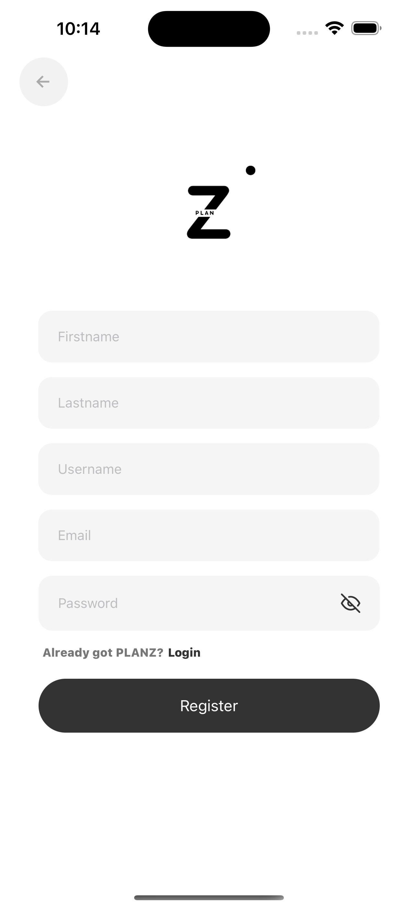
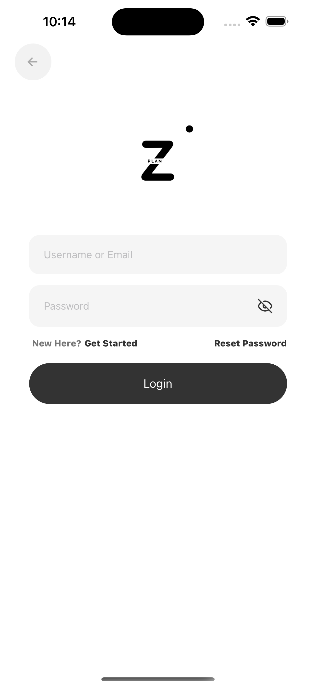
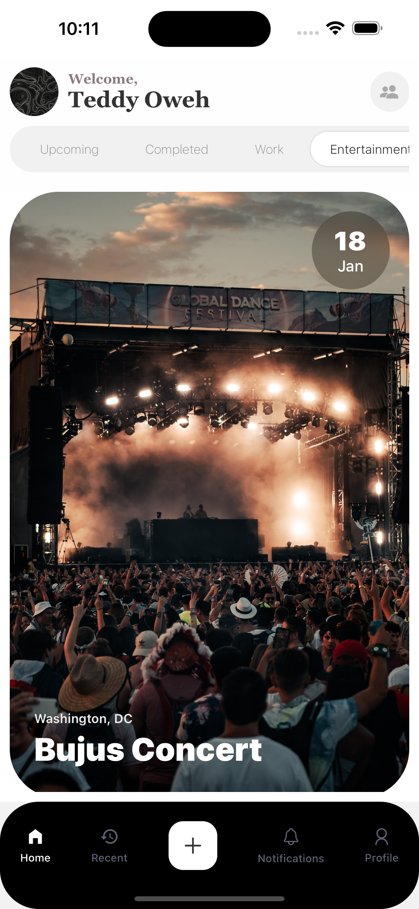
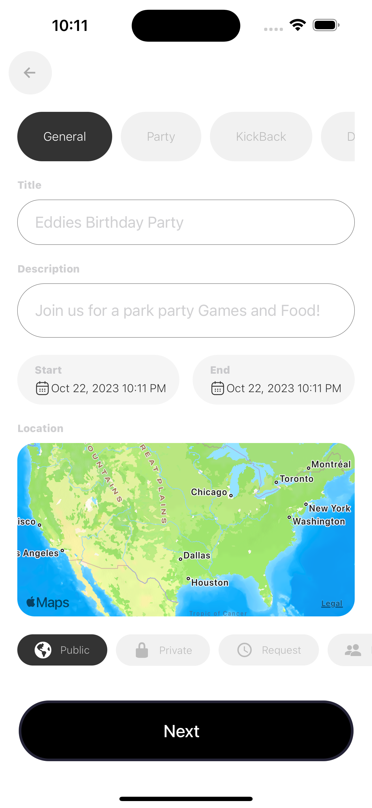

 
 
# Planz

Planz is an event coordination tool built using a modern technology stack. It simplifies event coordination and organization, providing a user-friendly interface for creating, managing, and tracking events. This is a proof of concept that was developed in under 6 hours (backend & frontend inclusive)

## Technology Stack

- Frontend: React Native
- Backend: Node.js, Express.js, MongoDB
- AI Integration:  @xenova/transformers, CLIPVisionModelWithProjection, CLIPTextModelWithProjection, OpenAI GPT-3.5 Turbo, Unsplash API

## Complex Methodologies

- Modular Backend Architecture: The backend follows a modular architecture with separate components for authentication, event management, and utility functions. This promotes code organization and maintainability.

- User Authentication: Planz implements user authentication using JSON Web Tokens (JWT). This ensures secure access to protected routes and user-specific data.

- AI Integration: Planz leverages AI models trained on event data and user preferences. These models provide intelligent features such as event recommendation, scheduling, and attendee matching.

- Mobile App Development: The front is built as a mobile application using React Native and Expo. This allows for cross-platform compatibility and easy deployment to iOS and Android devices.

- Git Version Control: The project utilizes Git for version control, enabling collaborative development and easy code management.

- Agile Development: The project follows Agile methodologies, including iterative development, continuous integration, and regular feedback cycles. This ensures efficient development and adaptability to changing requirements.

## Getting Started

To run the Planz application locally, follow these steps:

1. Clone the repository: `git clone https://github.com/teddyoweh/planz.git`
2. Install dependencies: `cd planz && npm install`
3. Set up the backend environment: Create a `.env` file in the `backend` directory and configure the necessary environment variables (e.g., MongoDB URI, JWT secret key, AI API keys).
4. Start the backend server: `cd backend && node server.js`
5. Start the mobile app: `cd ../planz && npm start`
6. Use the Expo app or an emulator to run the app on your device.

## Demo

  

  

  

  

These images provide visual representations of the project.
